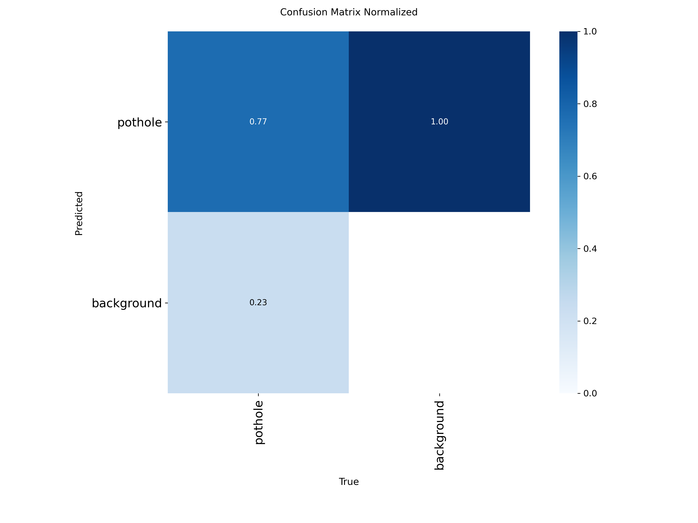

This repository represents a trained YOLOv8 object detection model on an Ubuntu 22 Core i9 PC

The model uses **Ultralytics YOLOv8**

and was trained purely on the CPU using a custom dataset from Roboflow (https://public.roboflow.com/object-detection/pothole) + manually added background-only samples.   

The outcome of this project could be useful in a diversity of resrearch or engineering fields such as **Autonomous Vehicles**, **Smart City Initiatives**, **Traffic Monitoring** etc...

**Results**

### Confusion Matrix

The model correctly predicted **77%** of the potholes while **23%** were predicted as background. 

In addition to that, **100%** of the background was predicted as potholes. This proves the limitations exhibited by the model

**Limitations**:
  The trained dataset had numerous pothole images with very limited clean road images. This explains the wrong predictions of the model.

**Future Work**:
  - Add more clean road images to imorove the model's robustness and predictions.
  - Retrain the model and assess performance

    

  
  
